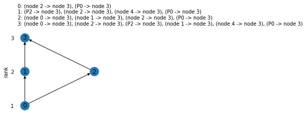
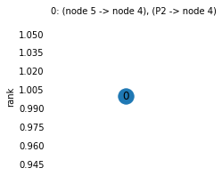

# IdentiFlow
Interaction strengths between nodes in directed networks can be quantified from observations of the network's response to perturbations. This package reveals the identifiability of the inferred network parameters and optimizes experimental design for network perturbation studies. See an upcoming publication for details.


You can install the IdentiFlow package with [pip](https://pypi.org/project/pip/):

```
pip install git+https://github.com/GrossTor/IdentiFlow#egg=identiflow
```

The package is easy to use and we demonstrate its most relevant features in the example below. You find the example script in [identiflow/examples](identiflow/examples). This folder also contains the scripts that were used to analyse the KEGG pathways, as described in our [paper](https://????).


After successful installation of the package you are able to import it in your Python session.


```python
import identiflow
```

### Input
First we define the network topology as a networkx Digraph and specify perturbations and their targets in a dictionary.


```python
import networkx as nx

edges = [('node 0', 'node 1'),
         ('node 0', 'node 2'),
         ('node 0', 'node 3'),
         ('node 1', 'node 3'),
         ('node 2', 'node 3'),
         ('node 3', 'node 0'),
         ('node 4', 'node 3'),
         ('node 4', 'node 5'),
         ('node 5', 'node 4')]

perturbations = {'P0': {'node 0', 'node 3'},
                 'P1': {'node 2'},
                 'P2': {'node 3', 'node 4'}}


net = nx.DiGraph(edges)

#There must be no self_loops. The next line ensures it.
net.remove_edges_from(nx.classes.selfloop_edges(net))
```

## Identifiability
Next, we investigate which of the interaction and perturbation strengths are identifiable in this perturbation experiment. This can be done with the function `infer_identifiability` (or `infer_identifiability_by_simulation`, see function documentation for details). It returns dictionaries that specify the dimensionality of the associated solution spaces and the identifiability status. The latter can be depicted by the plotting function `draw_identifiability_graph`.


```python
sol_space_dims, identifiability = \
    identiflow.infer_identifiability(net,perturbations)
sol_space_dims_simu, identifiability_simu = \
    identiflow.infer_identifiability_by_simulation(net,perturbations)

identiflow.draw_identifiability_graph(identifiability)
```


To elucidate the identifiability relationships between groups of network parameters we can can determine the cyclic flats using the function `infer_identifiability_relationships` and plot them with `draw_lattice`.


```python
cyclic_flats_dict = \
    identiflow.infer_identifiability_relationships(net, perturbations)
for node in cyclic_flats_dict:
    if sol_space_dims[node]>0:
        fig,ax=identiflow.draw_lattice(cyclic_flats_dict[node])
```








## Experimental design
IdentiFlow also allows to identify perturbation sequences that maximize the number of identifiable parameters with a minimal number of perturbations. The function `optimize_experimental_design` has different options to do so, that are described in detail in its documentation. Here we try a few and compare their performances.


```python
nodes = list(net.nodes)

#we allow all single target perturbations

perturbations = {'P{0}'.format(i):{nodes[i]} for i in range(len(nodes))}
exhaustive = identiflow.optimize_experimental_design(net, perturbations,
                                strategy='exhaustive',sampling=False)

greedy = identiflow.optimize_experimental_design(net, perturbations,
                                strategy='greedy',sampling=False)

multi_target = identiflow.optimize_experimental_design(net, perturbations,
                                strategy='multi_target',sampling=False)

naive = identiflow.optimize_experimental_design(net, perturbations,
                                strategy='naive',sampling=False)

random = identiflow.optimize_experimental_design(net, perturbations,
                                strategy='random',sampling=True, n_samples=1)

print('\nPerformance:\n\n   exhaustive: {0}\n   greedy: {1}\n   multi_target: {2}\n   naive: {3}\n   random: {4}'.format(
        exhaustive['ident_AUC'],greedy['ident_AUC'],multi_target['ident_AUC'],naive['ident_AUC'], random['ident_AUC']))
```

    Performance:
    
       exhaustive: 0.7592592592592593
       greedy: 0.7592592592592593
       multi_target: 0.8148148148148148
       naive: 0.7407407407407407
       random: 0.48148148148148145
    
    Best perturbation sequences:
    
       greedy:
    
    [('P5', 'P0', 'P1', 'P2', 'P4'),
     ('P5', 'P0', 'P2', 'P1', 'P4'),
     ('P4', 'P0', 'P1', 'P2', 'P5'),
     ('P4', 'P0', 'P2', 'P1', 'P5')]
    
       multi-target:
    
    [({'P5'}, {'P0', 'P4'}, {'P2'}, {'P1'}),
     ({'P5'}, {'P0', 'P4'}, {'P1'}, {'P2'}),
     ({'P4'}, {'P0', 'P5'}, {'P2'}, {'P1'}),
     ({'P4'}, {'P0', 'P5'}, {'P1'}, {'P2'})]
